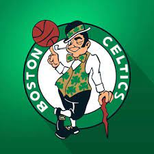

<h1>Memoria del proyecto fin de evaluación de Lenguajes de Marcas - 1º DAW</h1>
<h2>Celtics - Website tribute </h2>
<h2>Indice</h2>
<ul>
  <li><a href="#introduccion">Introducción</a></li>
  <li><a href="#motivacion">Motivación</a></li>
  <li><a href="#estructura">Estructura</a></li>
  <li><a href="#estilo">Estilo</a></li>
</ul>

<h2 id="introduccion">Introducción</h2>

Trabajo realizado por: Sergio Ramos Alarcón 

Proyecto de web "from scratch" de 1ª evaluación de Lenguajes de Marcas

Diciembre de 2023 

Licencia CC-BY

<h2 id="motivacion">Motivación</h2>

El tema lo he elegido porque de pequeño era muy fan de este equipo de baloncesto y creo que hacer esta página web es para hacerle un hueco en mi corazón 

<h2 id="estructura">Estructura</h2>

La web está dividida en  X secciones:

<ul>
  <li>Home (Hero Section)</li>  
  <li>Introducción </li>
  <li>Trophies </li>
  <li>Video </li>
  <li>Coaching Staff </li>
  <li>Gallery </li>
  <li>Footer </li>
</ul>

<h3>Hero Section</h3>

He utilizado una imagen de fondo tomada de una aportación de un fan, tiene una buena resolución y encaja perfectamente con la temática de mi página web. 
Encima de la imagen he colocado un botón que  
(una breve explicación)

<h3>Introducción</h3>
 

He dispuesto en un grid de 2 columnas, en una he puesto un accordion, y en la otra la imagen del escudo del equipo.

<h3>Trophies</h3>

y aqui pongo <b>lo que quiera</b>

<h3>Footer</h3>
<h4>Menú vertical izquierdo</h4>

En el footer he incluido un apartado de redes sociales (facebook, twitter, instagram, linkedin), los cuales al hacer click encima de sus respectivas imágenes le llevará a las redes sociales oficiales del equipo de baloncesto. Además he incluido un apartado denomidado "Site oficial" que le llevará directamente a la página web oficial. Por último he añadido un apartado de créditos que funciona con una ventana emergente (modal).

<h4>Menú vertical derecho</h4>

He implementado un pequeño menú vertical con todas los apartados de la página web por si es que te has quedado con más ganas de echarle un vistazo.

<h4>Localización</h4>

He añadido un enlace directo al estadio del equipo de baloncesto por si es que te da por querer ir a ver unos de sus emocionantes partidos.

<h2 id="estilo">Estilo de la página</h2>
<h3>Paleta de colores</h3>

 
    #008346

    black

    white 

<h3>Tipografías</h3>

  Texto normal -> Vintage Browner

  Títulos      -> Net Proxima Nova Bold

<h3>Imágenes</h3>

  

<h3>Videos</h3>

  

...................
<h2 id="snippets">Code snippets</h2>

He utilizado los siguientes:

<ul>
  <li>Barra de navegación: tomada de w3Schools "How to" https://www.w3schools.com/howto/howto_js_topnav.asp </li>
  <li>Accordion: tomado de freefronted "40 + CSS Accordions" https://freefrontend.com/css-accordions/ </li>
  <li>Modal: tomada de w3Schools "How to" https://www.w3schools.com/howto/howto_css_modals.asp </li>
</ul>
